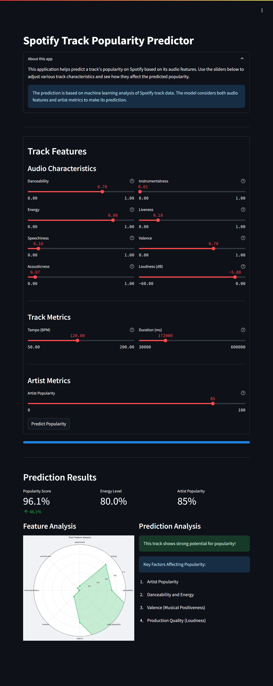

# Spotify Track Popularity Predictor

## Project Overview

The Spotify Track Popularity Predictor is a machine learning-powered application that predicts a song's potential popularity on Spotify based on its audio features. This innovative project combines music analysis with machine learning to help artists, producers, and music enthusiasts understand what makes a track popular on Spotify's platform.

The application analyzes various audio features such as danceability, energy, tempo, and acousticness, along with artist metrics, to provide insights into a track's potential popularity. Using a sophisticated machine learning model trained on Spotify's track database, it offers predictions and visual analysis of musical characteristics that contribute to a song's success.

The project showcases the practical application of machine learning in the music industry, featuring:
- Interactive web interface built with Streamlit
- Real-time popularity predictions
- Visual analysis of track features
- Comprehensive insights into feature importance
- Multiple deployment options for different use cases

This project draws inspiration from Spotify's audio analysis capabilities and aims to make these insights accessible to everyone interested in music production and analysis.




## Table of Contents

1. [Dataset](#dataset)
2. [Model Training](#model-training)
3. [Streamlit Application](#streamlit-application)
4. [Deployment Options](#deployment-options)
5. [File Structure](#file-structure)
6. [Usage](#usage)
7. [License](#license)

## Dataset

The model is trained on Spotify track data, including audio features and popularity metrics. The dataset (`music_analysis.csv`) contains various musical attributes and popularity scores for a diverse range of tracks. The analysis and preprocessing steps are documented in the Jupyter notebooks included in the repository.

## Model Training

The model training process is detailed in two Jupyter notebooks:
- `Music_Popularity.ipynb`: Initial data analysis and model development
- `Music_Popularity_Spotify_Data.ipynb`: Advanced feature engineering and model optimization

The trained model and scaler are saved as:
- `spotify_popularity_model.joblib`: The trained prediction model
- `spotify_scaler.joblib`: Feature scaler for input normalization

## Streamlit Application

The application (`app/app.py`) provides an intuitive interface for:
- Adjusting audio features using interactive sliders
- Visualizing feature relationships
- Getting real-time popularity predictions
- Analyzing feature importance

## Deployment Options Detailed Guide

### 1. Local Deployment
First ensure you have Python 3.8+ installed on your system. Then follow these steps:
```bash
git clone https://github.com/pouryare/spotify-track-popularity-predictor.git
cd spotify-track-popularity-predictor/app
python -m venv venv
source venv/bin/activate  # On Windows use `venv\Scripts\activate`
pip install -r requirements.txt
streamlit run app.py
```
The application will be available at `http://localhost:8501`

### 2. Docker Deployment
Ensure Docker is installed on your system. You have two options:

a) Pull and run the pre-built image:
```bash
docker pull pouryare/spotify-track-popularity-predictor:latest
docker run -p 8501:8501 pouryare/spotify-track-popularity-predictor:latest
```

b) Build and run locally:
```bash
cd app
docker build -t spotify-track-popularity-predictor:latest .
docker run -p 8501:8501 spotify-track-popularity-predictor:latest
```
Access the application at `http://localhost:8501`

### 3. Heroku Deployment
Prerequisites:
- Heroku account
- Heroku CLI installed
- Git installed

Steps:
```bash
heroku login
heroku create spotify-track-popularity-predictor
heroku buildpacks:add --index 1 heroku/python
heroku buildpacks:add --index 2 https://github.com/heroku/heroku-buildpack-apt
git push heroku main
```
Your app will be available at `https://spotify-track-popularity-predictor.herokuapp.com`

### 4. AWS EC2 Deployment
Prerequisites:
- AWS account
- EC2 instance running Amazon Linux 2
- SSH access to your instance

Steps:
1. Connect to your EC2 instance:
```bash
ssh -i your-key.pem ec2-user@your-instance-ip
```

2. Install dependencies:
```bash
sudo yum update -y
sudo yum install git python3 python3-pip -y
```

3. Clone and set up the application:
```bash
git clone https://github.com/pouryare/spotify-track-popularity-predictor.git
cd spotify-track-popularity-predictor/app
pip3 install -r requirements.txt
```

4. Start the application:
```bash
streamlit run app.py
```

5. Configure EC2 security group:
   - Add inbound rule for port 8501
   - Allow access from your IP or make it public

### 5. Google Cloud Platform Deployment
Prerequisites:
- Google Cloud account
- Google Cloud SDK installed
- Project created in Google Cloud Console

Steps:
1. Initialize your app:
```bash
gcloud init
gcloud app create
```

2. Deploy the application:
```bash
gcloud app deploy
gcloud app browse
```

### 6. Microsoft Azure Deployment
Prerequisites:
- Azure account
- Azure CLI installed
- Resource group and app service plan created

Steps:
1. Create the web app:
```bash
az webapp create --resource-group myResourceGroup \
                 --plan myAppServicePlan \
                 --name spotify-track-popularity-predictor \
                 --runtime "PYTHON|3.7"
```

2. Configure deployment from GitHub:
```bash
az webapp deployment source config \
    --name spotify-track-popularity-predictor \
    --resource-group myResourceGroup \
    --repo-url https://github.com/pouryare/spotify-track-popularity-predictor.git \
    --branch main \
    --manual-integration
```

## File Structure
```
spotify-track-popularity-predictor/
├── app/
│   ├── app.py
│   ├── app.yaml
│   ├── Dockerfile
│   ├── Procfile
│   ├── requirements.txt
│   ├── setup.py
│   ├── setup.sh
│   ├── spotify_popularity_model.joblib
│   └── spotify_scaler.joblib
├── music_analysis.csv
├── Music_Popularity.ipynb
├── Music_Popularity_Spotify_Data.ipynb
├── README.md
└── screenshot.png
```

## Usage

1. Access the application through your preferred deployment method
2. Use the sliders to adjust various audio features
3. Click "Predict Popularity" to get the prediction
4. Explore the visual analysis and feature importance
5. Experiment with different feature combinations to understand their impact on popularity

## Acknowledgments

This project was inspired by and builds upon several excellent works in the field of music analysis and machine learning:

- The Spotify API and their groundbreaking work in audio feature analysis
- Various machine learning projects in the music domain
- The Streamlit community for their excellent framework and examples
- Open-source contributors who have created similar music analysis tools

Special thanks to:
- The Spotify Web API team for providing comprehensive audio feature data
- The scikit-learn community for their machine learning tools
- The Streamlit team for their excellent framework
- The Python community for their various helpful packages

This project aims to build upon these foundations while providing a unique, user-friendly interface for music popularity prediction.

## Contributing

Contributions are welcome! Please feel free to submit a Pull Request. For major changes, please open an issue first to discuss what you would like to change.

## License

This project is licensed under the MIT License. See the [MIT License](https://opensource.org/licenses/MIT) page for details.

---

For issues or suggestions, please open an issue on the [GitHub repository](https://github.com/pouryare/spotify-track-popularity-predictor).

This project aims to bridge the gap between music production and data science, providing valuable insights into what makes songs popular on Spotify. Whether you're a music producer, artist, or data scientist, this tool offers practical insights into the relationship between audio features and track popularity.
